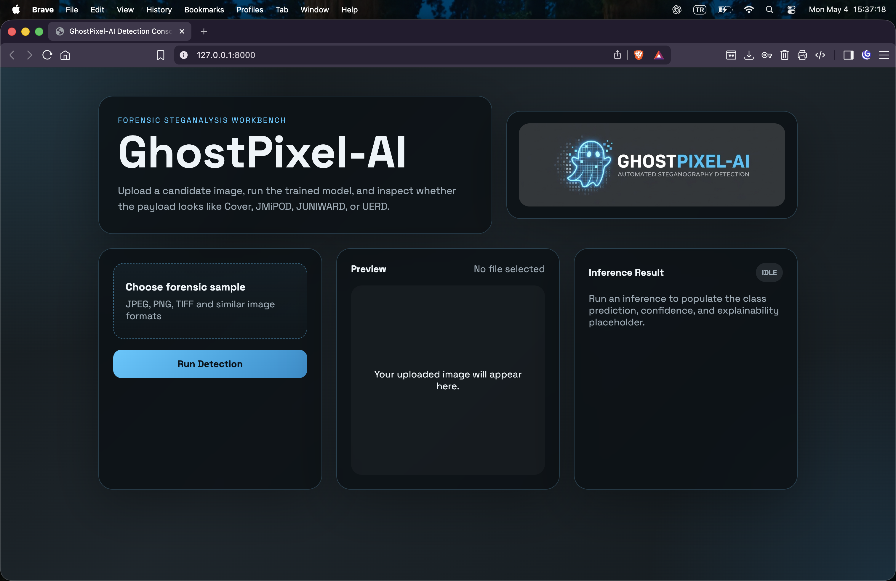

# GhostPixel-AI


GhostPixel-AI is a production-oriented repository scaffold for automated steganography detection on the ALASKA2 dataset. The stack uses Python 3.12+, PyTorch with Lightning, FastAPI for inference, Albumentations for forensic-safe preprocessing, and Pydantic v2 for configuration and response validation.

## Repository Layout

```text
GhostPixel-AI/
├── api/                 # FastAPI app, schemas, and inference dependencies
│   ├── static/          # Browser-facing styles for the test console
│   └── templates/       # FastAPI-served HTML UI
├── data/                # Dataset module, transforms, and raw dataset mount point
│   └── raw/             # Symlink target for ALASKA2 root
├── models/              # Residual layer, backbone model, Lightning wrapper
├── scripts/             # Training and evaluation entrypoints
├── settings.py          # Shared configuration via Pydantic settings
├── requirements.txt
├── Dockerfile
└── docker-compose.yaml
```

## ALASKA2 Dataset Placement

The repository expects the ALASKA2 folders to exist under `data/raw/` with this structure:

```text
data/raw/
├── Cover/
├── JMiPOD/
├── JUNIWARD/
├── Test/
└── UERD/
```

`Cover`, `JMiPOD`, `JUNIWARD`, and `UERD` are used for labeled 4-class training and validation. `Test` is treated as an unlabeled Kaggle inference split and is exposed through the same dataset/data module pipeline via `split="test"`.

If the dataset lives on an external drive, create a symlink into `data/raw` instead of copying the files:

```bash
mkdir -p data
ln -s /Volumes/ExternalDrive/ALASKA2 data/raw
```

If `data/raw` already exists as a normal directory, remove or rename it first, then recreate it as a symlink.

## Install

```bash
python3.12 -m venv .ghostenv
source .ghostenv/bin/activate
pip install -r requirements.txt
cp .env.example .env
```

For local quality checks:

```bash
pip install -r requirements-dev.txt
ruff check .
ruff format --check .
pytest
```

## Training

```bash
python scripts/train.py
```

Equivalent module form:

```bash
python -m scripts.train
```

Useful environment variables:

```bash
export GHOSTPIXEL_DATA_ROOT=data/raw
export GHOSTPIXEL_BACKBONE_NAME=mobilenet_v3_small
export GHOSTPIXEL_PRETRAINED_BACKBONE=true
export GHOSTPIXEL_FREEZE_BACKBONE=true
export GHOSTPIXEL_BATCH_SIZE=8
export GHOSTPIXEL_IMAGE_SIZE=224
export GHOSTPIXEL_NUM_WORKERS=2
export GHOSTPIXEL_LOSS_NAME=cross_entropy
export GHOSTPIXEL_LABEL_SMOOTHING=0.05
export GHOSTPIXEL_USE_CLASS_WEIGHTS=true
export GHOSTPIXEL_ACCUMULATE_GRAD_BATCHES=2
export GHOSTPIXEL_TRAIN_BATCHES_PER_EPOCH=2000
export GHOSTPIXEL_VAL_BATCHES_PER_EPOCH=200
export GHOSTPIXEL_SCHEDULER_T_MAX=30
export GHOSTPIXEL_STAGED_FINETUNING=false
export GHOSTPIXEL_BACKBONE_FINETUNE_LEARNING_RATE=0.00005
```

The default long-run profile now favors stability over aggressive fine-tuning: frozen pretrained backbone, `30` epochs, `2000` train batches per epoch, `200` validation batches, cross-entropy with label smoothing, optional automatic class weighting, and a longer cosine schedule. Focal loss is also supported by setting `GHOSTPIXEL_LOSS_NAME=focal`.

Each validation epoch now also prints a per-class report with precision, recall, F1, target share, prediction share, and the confusion matrix so long runs are easier to interpret.

When `GHOSTPIXEL_VAL_BATCHES_PER_EPOCH` is capped, the validation split is deterministically shuffled before batching so the subset remains class-mixed instead of evaluating only the first class on disk.

## Evaluation

```bash
export GHOSTPIXEL_CHECKPOINT_PATH=checkpoints/your-model.ckpt
python scripts/evaluate.py
```

## API Server

Run locally:

```bash
uvicorn api.main:app --reload
```

Browser test console:

```text
http://127.0.0.1:8000/
```



Inference request example:

```bash
curl -X POST "http://127.0.0.1:8000/detect" \
  -H "accept: application/json" \
  -H "Content-Type: multipart/form-data" \
  -F "file=@sample.jpg"
```

The response schema contains:

- `class_name`
- `confidence_score`
- `explainability_map` (currently a placeholder for a future saliency or localization artifact)

## Docker

```bash
docker compose up --build
```

Mount checkpoints into `./checkpoints` and dataset access into `./data`.

## CI

The repository includes a GitHub Actions workflow at `.github/workflows/ci.yml` that runs linting, formatting checks, Python compile smoke tests, synthetic unit tests, and a Docker build without requiring the full ALASKA2 dataset.
